# ACMI Operator Guide

**Getting started with Agentic Context Management Infrastructure — from zero to a running multi-agent fleet.**

This guide walks you through setting up ACMI from scratch, connecting your first agent, enabling monitoring, and deploying a production multi-agent coordination system.

---

## Prerequisites

| Requirement | Version | Notes |
|-------------|---------|-------|
| **Node.js** | 18+ | [Download](https://nodejs.org) |
| **Upstash Redis** | Free tier | [Sign up](https://console.upstash.com) — 10K commands/day free |
| **OpenClaw** | Latest | Optional but recommended for agent integration. [GitHub](https://github.com/nicepkg/openclaw) |
| **Git** | Any | For cloning the repo |

---

## Step 1: Create Upstash Redis

1. Go to [console.upstash.com](https://console.upstash.com/redis)
2. Click **Create Database**
3. Select the **Free** tier (10K commands/day — more than enough for development)
4. Name it `acmi` (or whatever you prefer)
5. Once created, open the database dashboard
6. Copy two values:
   - **UPSTASH_REDIS_REST_URL** — looks like `https://abc123.us1.upstash.io`
   - **UPSTASH_REDIS_REST_TOKEN** — a long alphanumeric string

> 💡 **Tip:** Upstash Redis is serverless — no servers to manage, automatic scaling, built-in REST API. Perfect for agent workloads that are bursty rather than constant.

---

## Step 2: Environment Variables

Create a `.env` file in the ACMI directory (or add to `~/.zshrc` / `~/.bashrc`):

```bash
# .env — ACMI Redis connection
UPSTASH_REDIS_REST_URL="https://<your-endpoint>.upstash.io"
UPSTASH_REDIS_REST_TOKEN="<your-token>"

# Optional — for rollup-cron.mjs LLM synthesis
ANTHROPIC_API_KEY="sk-ant-..."

# Optional — for OpenClaw agent integration
OPENCLAW_HOME="$HOME/.openclaw"
```

Load it before any ACMI command:

```bash
source .env
# or
export $(cat .env | xargs)
```

---

## Step 3: First ACMI Commands

Let's create your first entity and see ACMI in action.

### Create a Profile

```bash
node acmi.mjs profile "sales" "acme-corp" '{"name": "Acme Corp", "stage": "Discovery", "contact": "jane@acme.com"}'
```

### Log Events

```bash
node acmi.mjs event "sales" "acme-corp" "email" "Received initial inquiry from Jane."
node acmi.mjs event "sales" "acme-corp" "call" "Completed 30-min discovery call. Budget confirmed."
node acmi.mjs event "sales" "acme-corp" "email" "Sent proposal PDF."
```

### Update AI Signals

```bash
node acmi.mjs signal "sales" "acme-corp" '{"sentiment": "positive", "churn_risk": "low", "next_action": "Follow up by Friday", "confidence": 0.85}'
```

### Read the Full Context

```bash
node acmi.mjs get "sales" "acme-corp"
```

This returns a single JSON object with the profile, signals, and last 50 timeline events — exactly what an AI agent needs to understand this entity instantly.

---

## Step 4: Connect Your First Agent

### Clone & Install

```bash
git clone https://github.com/madezmedia/acmi.git
cd acmi
chmod +x acmi.mjs
```

### Verify Connectivity

```bash
# Set a test profile
node acmi.mjs profile "test" "connectivity" '{"status": "ok"}'

# Read it back
node acmi.mjs get "test" "connectivity"

# Clean up
node acmi.mjs delete "test" "connectivity"
```

If the get returns your profile JSON, you're connected. ✅

### Agent Spawn Protocol

When an agent starts a session, it should:

```bash
# 1. Log the spawn
node acmi.mjs spawn my-agent "sess_$(date +%s)" "my-model-id"

# 2. Bootstrap context (profile + signals + active threads + rollup + recent events)
node acmi.mjs bootstrap my-agent
```

### OpenClaw Integration

If using OpenClaw, copy the entire ACMI directory:

```bash
cp -r . ~/.openclaw/skills/acmi/
```

The agent will automatically discover ACMI commands and use them for cross-session context.

---

## Step 5: Set Up Agent Coordination

ACMI's coordination layer lets multiple agents communicate through a shared timeline.

### Create the Coordination Thread

```bash
# Create the canonical coordination thread
node acmi.mjs profile "thread" "agent-coordination" '{"purpose": "Fleet-wide coordination", "created": "2026-04-29"}'
```

### Post Your First Coordination Event

Every coordination event **must** include the five mandatory fields (Communication Standard v1.1):

```bash
node acmi.mjs event "thread" "agent-coordination" "my-agent" \
  --kind tick-start \
  --correlationId "firstCoord-$(date +%s)000" \
  "[tick] First coordination event — system online"
```

### Verify

```bash
node acmi.mjs get "thread" "agent-coordination"
```

You should see your event in the timeline with all required fields.

---

## Step 6: Enable Anti-Dead Monitoring

Anti-dead monitoring ensures no project or agent silently stalls.

### Configure Heartbeat

Each agent should update its heartbeat on every tick:

```bash
# In agent's wake cycle or main loop
node acmi.mjs signal "agent" "my-agent" "$(node -e "
  const s = JSON.parse('$(node acmi.mjs get agent my-agent | jq .signals)');
  s.last_heartbeat_ts = Date.now();
  s.status = 'active';
  console.log(JSON.stringify(s));
")"
```

Or more simply, merge the update:

```bash
node acmi.mjs signal "agent" "my-agent" '{"last_heartbeat_ts": '$(date +%s000)', "status": "active"}'
```

### Stall Detection

Run `drift-diff.mjs` hourly to detect stalled entities:

```bash
node drift-diff.mjs
```

This checks all namespaces for entities with `last_heartbeat_ts` older than 48 hours and marks them STALLED. Stalled entities are escalated to the HITL queue:

```bash
# Check the HITL queue
# (Direct REST call — replace with your Upstash credentials)
curl -sS -X POST \
  -H "Authorization: Bearer $UPSTASH_REDIS_REST_TOKEN" \
  -H "Content-Type: application/json" \
  "$UPSTASH_REDIS_REST_URL" \
  -d '["ZRANGE", "acmi:user:operator:hitl-queue", "0", "-1", "REV"]'
```

---

## Step 7: Start the Reinforcement Learning Cycle

### Log Your First Assessment

After completing a task, score it:

```bash
node acmi.mjs event "workflow" "content-agency" "my-agent" \
  --kind assessment \
  --correlationId "assess-draft-$(date +%s)000" \
  '{"stepId": "draft", "score": 78, "criteria": "relevance, tone, accuracy"}'
```

### Log a Lesson Learned

```bash
node acmi.mjs event "workflow" "content-agency" "my-agent" \
  --kind improvement \
  --correlationId "improve-draft-$(date +%s)000" \
  '{"stepId": "draft", "lesson": "Shorter paragraphs score higher for engagement"}'
```

### Track Improvement Over Time

```bash
# Read all assessments for a workflow
node acmi.mjs get "workflow" "content-agency"
```

Over time, the accumulated assessments and improvements form a learning database. Before each new run, agents query prior assessments to seed their context with lessons learned.

---

## Step 8: Deploy Cron Jobs

ACMI includes several tools designed to run as cron jobs:

### Hourly Sync

```bash
# Drift detection + comms format enforcement
0 * * * * /usr/bin/env bash -c 'source /path/to/.env && node /path/to/acmi/drift-diff.mjs' >> /tmp/acmi-drift.log 2>&1
```

### Rollup Synthesis (every 6 hours)

```bash
# Synthesize agent timelines into summaries
0 */6 * * * /usr/bin/env bash -c 'source /path/to/.env && node /path/to/acmi/rollup-cron.mjs my-agent' >> /tmp/acmi-rollup.log 2>&1
```

### Quota Monitoring (every 2 hours)

```bash
# Check API quota health across providers
0 */2 * * * /usr/bin/env bash -c 'source /path/to/.env && node /path/to/acmi/quota-monitor.mjs' >> /tmp/acmi-quota.log 2>&1
```

### Standup Brief (daily at 9 AM)

```bash
# Generate daily standup from ACMI timelines
0 9 * * * /usr/bin/env bash -c 'source /path/to/.env && node /path/to/acmi/standup-brief.mjs' >> /tmp/acmi-standup.log 2>&1
```

### OpenClaw Cron (if using OpenClaw)

```bash
# Add via OpenClaw CLI
openclaw cron add --schedule "0 * * * *" --task "Hourly ACMI drift check"
openclaw cron add --schedule "0 */6 * * *" --task "ACMI rollup synthesis for my-agent"
```

---

## Step 9: Multi-Agent Fleet

### Add a Second Agent

```bash
# Create agent profile
node acmi.mjs profile "agent" "agent-two" '{
  "role": "researcher",
  "model": "kimi-k2.5",
  "tier": "T3",
  "specialties": ["long-context analysis", "research"]
}'

# Or use the invite helper
node invite-agent.mjs agent-two researcher kimi-k2.5 T3
```

### Set Up Hourly Wakes

Stagger agent wake times to avoid coordination conflicts:

```bash
# Agent 1 — :15 past the hour
15 * * * * ... node acmi.mjs event thread agent-coordination agent-one --kind wake-status --correlationId "wake-agent-one-$(date +\%s)000" "Wake :15 — starting hourly sync"

# Agent 2 — :30 past the hour
30 * * * * ... node acmi.mjs event thread agent-coordination agent-two --kind wake-status --correlationId "wake-agent-two-$(date +\%s)000" "Wake :30 — starting hourly sync"
```

### Configure Lock-Protocol

Before any agent starts a batch task, it must claim the coordination lock:

```bash
# Claim
node acmi.mjs event "thread" "agent-coordination" "agent-one" \
  --kind coord-claim \
  --correlationId "lock-data-import-$(date +%s)000" \
  '[lock] Claiming data import for batch execution'

# ... do the work ...

# Release
node acmi.mjs event "thread" "agent-coordination" "agent-one" \
  --kind coord-release \
  --correlationId "lock-data-import-$(date +%s)000" \
  '[unlock] Data import batch complete'
```

### Handoff Workflow

```bash
# Agent 1 hands off to Agent 2
node acmi.mjs event "thread" "agent-coordination" "agent-one" \
  --kind handoff-request \
  --correlationId "handoff-research-$(date +%s)000" \
  '[handoff] Research task → @agent-two'

# Agent 2 acknowledges
node acmi.mjs event "thread" "agent-coordination" "agent-two" \
  --kind handoff-ack \
  --correlationId "handoff-research-$(date +%s)000" \
  '[ack] Taking the research task'

# Agent 2 completes
node acmi.mjs event "thread" "agent-coordination" "agent-two" \
  --kind handoff-complete \
  --correlationId "handoff-research-$(date +%s)000" \
  '[done] Research complete — 15 sources analyzed'
```

---

## Step 10: Production Checklist

Before running ACMI in production, verify:

### Redis Backup
- [ ] Upstash automatic backups enabled (free tier includes daily backups)
- [ ] Run `acmi-backup.mjs` daily to export a local snapshot
- [ ] Test restore procedure from backup

### Environment Security
- [ ] `.env` file has restrictive permissions (`chmod 600 .env`)
- [ ] Redis token is not committed to git (add `.env` to `.gitignore`)
- [ ] Production tokens are rotated periodically

### Rate Limiting
- [ ] Monitor Upstash command count vs. plan limits
- [ ] `quota-monitor.mjs` runs every 2 hours
- [ ] Alert set up for >80% quota usage

### Monitoring
- [ ] `drift-diff.mjs` runs hourly for health checks
- [ ] Anti-dead monitoring active (48h stall detection)
- [ ] HITL queue checked at least twice daily
- [ ] `standup-brief.mjs` runs daily for operational overview

### Agent Health
- [ ] All agents post `wake-status` during hourly cycles
- [ ] `last_heartbeat_ts` updated on every tick
- [ ] Escalation path configured (silent for 3+ hours → HITL)

---

## Troubleshooting

### Common Errors

#### `Error: Missing UPSTASH_REDIS_REST_URL`

**Cause:** Environment variables not loaded.

**Fix:**
```bash
source .env
# or
export UPSTASH_REDIS_REST_URL="https://..."
export UPSTASH_REDIS_REST_TOKEN="..."
```

#### Events vanish after posting

**Cause:** Using `thread:topic` format in the namespace argument (known CLI footgun).

**Fix:** Always use separate `ns` and `id` arguments:
```bash
# WRONG — events vanish
node acmi.mjs event "thread:bentley-pm" "" source "summary"

# RIGHT
node acmi.mjs event "thread" "bentley-pm" source "summary"
```

#### `rollup-cron.mjs` exits without writing

**Cause:** Missing `ANTHROPIC_API_KEY` or empty timeline window.

**Fix:** This is expected behavior — the cron exits cleanly when there's nothing to synthesize. Only set `ANTHROPIC_API_KEY` if you want LLM-powered rollup synthesis.

#### Redis command limit exceeded

**Cause:** Free tier is 10K commands/day.

**Fix:**
1. Check usage with `quota-monitor.mjs`
2. Reduce cron frequency
3. Upgrade to Upstash Pro ($0.20/100K commands)

#### `correlation_id` (snake_case) in events

**Cause:** Legacy format from before Communication Standard v1.1.

**Fix:** All new events must use `correlationId` (camelCase). Run `drift-diff.mjs` to detect violations.

### FAQ

**Q: Can I use a different Redis provider?**
A: ACMI uses the Upstash REST API. If your Redis provider supports a REST-compatible API with the same command format, it should work. Standard Redis TCP connections are not supported by the current implementation.

**Q: How much data can I store?**
A: Upstash free tier includes 256MB. A typical ACMI entity (profile + signals + 50 events) is ~5-10KB. That's room for tens of thousands of entities.

**Q: Can multiple agents write to the same timeline?**
A: Yes — that's the entire point. ACMI timelines are append-only (ZADD). Multiple agents can write simultaneously. Use the Lock-Protocol for batch mutations.

**Q: Do I need OpenClaw?**
A: No. ACMI works standalone with just Node.js and Upstash Redis. OpenClaw integration is optional and provides automatic agent skill discovery.

**Q: How do I back up my data?**
A: Upstash provides automatic daily backups on all plans. For local backups, run `acmi-backup.mjs` (included in the companion tools).

---

## Architecture Diagram

```mermaid
graph TB
    subgraph "Your Infrastructure"
        Human[Human Operator]
        
        subgraph "Agent Fleet"
            Agent1[Agent 1<br/>Orchestrator]
            Agent2[Agent 2<br/>Coder]
            Agent3[Agent 3<br/>Researcher]
        end
        
        subgraph "Cron Jobs"
            Drift[drift-diff.mjs<br/>Hourly]
            Rollup[rollup-cron.mjs<br/>Every 6h]
            Quota[quota-monitor.mjs<br/>Every 2h]
            Standup[standup-brief.mjs<br/>Daily]
        end
    end

    subgraph "Upstash Redis — ACMI Engine"
        CoordThread[Coordination Thread<br/>acmi:thread:agent-coordination]
        
        subgraph "Per-Entity (3 Pillars)"
            Profile[(Profile<br/>STRING JSON)]
            Signals[(Signals<br/>STRING JSON)]
            Timeline[(Timeline<br/>ZSET)]
        end
        
        HitlQueue[HITL Queue<br/>acmi:user:operator:hitl-queue]
        WorkItems[Work Items<br/>acmi:work:*]
    end

    %% Agent flows
    Agent1 -->|read/write| Profile
    Agent1 -->|read/write| Signals
    Agent1 -->|ZADD events| Timeline
    Agent2 -->|read/write| Profile
    Agent2 -->|ZADD events| Timeline
    Agent3 -->|read/write| Profile
    Agent3 -->|ZADD events| Timeline

    %% Coordination
    Agent1 -->|coord-claim/release| CoordThread
    Agent2 -->|handoff-request/complete| CoordThread
    Agent3 -->|roundtable-input| CoordThread
    Agent1 -->|wake-status| CoordThread

    %% Cron
    Drift -->|health check| CoordThread
    Rollup -->|synthesis| Signals
    Quota -->|monitor| CoordThread

    %% HITL
    Agent1 -->|escalate| HitlQueue
    Human -->|resolve| HitlQueue

    %% Work items
    Agent1 -->|work event| WorkItems
    Agent2 -->|work event| WorkItems
```



---

## Next Steps

1. **Read the [SKILL.md](./SKILL.md)** for complete CLI command documentation
2. **Read the [ACMI Protocol v1.2](./ACMI-PROTOCOL-v1.2.md)** for the normative specification
3. **Read the [ACMI Cheatsheet](./ACMI-CHEATSHEET.md)** for a quick reference of namespaces, commands, and workflows
4. **Set up your first fleet** — follow Steps 5-9 above
5. **Enable the RL cycle** — start logging assessments and improvements (Step 7)
6. **Deploy cron jobs** — get continuous monitoring and synthesis running (Step 8)

---

*Built by the ACMI Fleet. Questions? Open an issue on [GitHub](https://github.com/madezmedia/acmi).*
