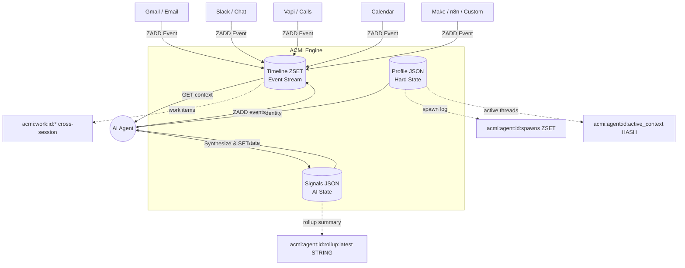

<p align="center">
  
</p>

# ACMI — Agentic Context Memory Interface

[](https://www.npmjs.com/package/@madezmedia/acmi)
[](./SPEC.md)
[](./LICENSE)
[](https://nodejs.org)
[](./tests)

> **Product page:** [v3-ten-beta.vercel.app/acmi](https://v3-ten-beta.vercel.app/acmi/) · the canonical narrative, install card, and visual demo of the three-key model.

> **Cross-references:** This is the **protocol + SDK** repo. For the live demo, ops-center dashboard, and OAuth-protected cloud MCP endpoint, see the sibling repo [`madezmedia/acmi-product`](https://github.com/madezmedia/acmi-product). For the hackathon judge demo, see the HF Space [`madezmedia/acmi-timeline-browser`](https://huggingface.co/spaces/madezmedia/acmi-timeline-browser).

> **Try the live demo:** [v3-ten-beta.vercel.app/acmi](https://v3-ten-beta.vercel.app/acmi/) (ops-center) · [HF Space](https://huggingface.co/spaces/madezmedia/acmi-timeline-browser) (multi-framework chain browser)

**ACMI is a universal, namespace-driven framework that gives AI agents persistent, real-time context — replacing fragmented SQL joins and multi-table queries with a single, LLM-optimized Key-Value engine backed by serverless Redis.** Every entity stores exactly three things an LLM needs to make decisions: a **Profile** (who/what is this entity), **Signals** (what does the AI think about it), and a **Timeline** (everything that happened, chronologically, from every source). The result: agents wake up, read one JSON payload, and immediately understand the full context of any deal, ticket, project, or task — no joins, no bloat, no tokens wasted on schema artifacts.

```
Profile  →  who   (identity, preferences — stable)
Signals  →  now   (current state — what's open, what's pending)
Timeline →  then  (append-only event log)
```

That's it. No vector index. No knowledge graph. No fact-extraction LLM pass. Just three keys per entity, stored in the simplest data store on earth.

---

## Install

```bash
npm install @madezmedia/acmi
```

## 10-line example

```ts
import { createAcmi } from "@madezmedia/acmi";
import { InMemoryAdapter } from "@madezmedia/acmi/adapters/in-memory";

const acmi = createAcmi(new InMemoryAdapter());

await acmi.profile.set("user:mikey", { name: "Mikey", tz: "America/New_York" });
await acmi.signals.set("user:mikey", "current_task", "shooting ACMI manifesto");
await acmi.timeline.append("user:mikey", {
  source: "user:mikey",
  kind: "started_recording",
  correlationId: "manifesto-001",
  summary: "video 1 of 3",
});

console.log(await acmi.timeline.read("user:mikey"));
```

That runs. Copy-paste, save as `acmi.mjs`, `node acmi.mjs`. The in-memory adapter is zero-dependency, so this is the fastest path to feeling the API.

## Production: connect to Upstash (edge-compatible)

```ts
import { createAcmi } from "@madezmedia/acmi";
import { UpstashAdapter } from "@madezmedia/acmi/adapters/upstash";

const acmi = createAcmi(
  new UpstashAdapter({
    url: process.env.UPSTASH_REDIS_REST_URL!,
    token: process.env.UPSTASH_REDIS_REST_TOKEN!,
  })
);
```

Or self-hosted Redis:

```ts
import Redis from "ioredis";
import { createAcmi } from "@madezmedia/acmi";
import { RedisAdapter } from "@madezmedia/acmi/adapters/redis";

const acmi = createAcmi(
  new RedisAdapter({
    client: new Redis(process.env.REDIS_URL!),
    ownClient: true,
  })
);
```

## Adapters

| Adapter | Use case | Edge-compat | Status |
|---|---|---|---|
| `@madezmedia/acmi/adapters/in-memory` | Tests, examples, dev | n/a | ✅ stable |
| `@madezmedia/acmi/adapters/upstash` | Edge runtimes (Workers, Vercel Edge, Deno Deploy) | ✅ | ✅ stable |
| `@madezmedia/acmi/adapters/redis` | Self-hosted / Node.js (`ioredis`) | ❌ | ✅ stable |

Want to write your own (DynamoDB, Cloudflare KV, FoundationDB, …)? See [`CONTRIBUTING.md`](CONTRIBUTING.md) — the conformance suite at `@madezmedia/acmi/testing/conformance` tells you when you're done.

---

## The Problem: Why SQL/Postgres Doesn't Work for AI Agents

When agents try to understand a "deal," "support ticket," or "dispatch truck," traditional apps force them to query multiple normalized tables (`users`, `messages`, `meetings`, `notes`) and join them together. This is:

- **Slow** — multiple round-trips, each one burning latency and tokens
- **Expensive** — context windows fill with useless database schema artifacts
- **Fragile** — schema changes break agent context pipelines
- **Wrong abstraction** — agents don't need normalized data; they need state snapshots and chronological timelines

ACMI solves this by decoupling the **application layer** from the **agent layer**. Your SaaS still uses Postgres for transactional integrity. ACMI sits alongside it, maintaining the exact context agents need — in the format they need it.

---

## Storage shape

Every entity in ACMI — whether it's a CRM contact, a support ticket, an AI agent, or a cross-session project — is stored using the same three keys:

| Slot | Redis Key | Type | Purpose |
|------|-----------|------|---------|
| **Profile** | `acmi:{namespace}:{id}:profile` | STRING (JSON) | Hard state — who/what is this entity? Name, stage, specs, budget. Slow-changing. |
| **Signals** | `acmi:{namespace}:{id}:signals` | STRING (JSON) | Soft state — what does the AI think? Sentiment, churn risk, next action. Updated frequently. |
| **Timeline** | `acmi:{namespace}:{id}:timeline` | ZSET (score=ts_ms) | Event stream — everything that happened, from every source, in chronological order. |



### Long-Context Extensions

For long-lived agents that span many sessions, ACMI adds optional keys layered on the same primitives:

| Key | Type | Purpose |
|-----|------|---------|
| `acmi:agent:{id}:spawns` | ZSET | Every session start — `{ts, session_id, model_id, host}` |
| `acmi:agent:{id}:active_context` | HASH | Threads the agent is currently engaged in |
| `acmi:agent:{id}:rollup:latest` | STRING | LLM-synthesized summary of recent timeline (cheap read on spawn) |
| `acmi:work:{id}:*` | profile/signals/timeline/sessions | Cross-session projects, ideas, and tasks |

---

## v1.2 Protocol Highlights

The full protocol lives in [`SPEC.md`](./SPEC.md). The legacy v1.2 normative doc is preserved at [`docs/ACMI-PROTOCOL-v1.2.md`](./docs/ACMI-PROTOCOL-v1.2.md).

### Communication Standard (Comms v1.1)

Every event posted to coordination timelines **MUST** include five mandatory fields:

```json
{
  "ts": 1745947200000,
  "source": "claude-engineer",
  "kind": "handoff-complete",
  "correlationId": "acmiPublicReadme-1745947200000",
  "summary": "[done] README.md rewritten to v1.2 spec",
  "payload": { "url": "https://github.com/madezmedia/acmi" }
}
```

| Field | Required | Notes |
|-------|----------|-------|
| `ts` | ✅ | Unix timestamp in milliseconds |
| `source` | ✅ | Agent ID (e.g. `bentley`, `claude-engineer`) |
| `kind` | ✅ | Event type enum (handoff, roundtable, coord-claim, etc.) |
| `correlationId` | ✅ | **camelCase ONLY** — no snake_case, no missing field |
| `summary` | ✅ | ≤500 character human-readable description |

The SDK validates these fields on the producer side — `acmi.timeline.append(...)` throws if any is missing or non-string.

### Lock-Protocol v1.0

Prevents duplicate work between agents or parallel sessions:

1. **Claim** — Before a batch task, post `kind: "coord-claim"` to the coordination thread
2. **Verify** — Other agents scan last 10 minutes for existing claims with the same task
3. **Hedge** — If a claim exists within the 5-minute window, the second agent defers
4. **Release** — On completion, post `kind: "coord-release"` to unlock

### Anti-Dead Heartbeats

- Agents update `signal.last_heartbeat_ts` on every tick
- Projects silent for **>48 hours** are auto-marked **STALLED**
- Stalled projects escalate to the human-in-the-loop (HITL) queue

### Reinforcement Learning Cycle

Every workflow step goes through a mandatory learning cycle:

```
Execute → Assess → Log → Analyze → Adjust → Execute (improved)
```

- `logAssessment(stepId, score, criteria)` — score 0–100 per step
- `logImprovement(stepId, lesson)` — capture what worked and what didn't
- Prior improvement logs seed the next run's context
- **No execution without an assessment entry**

---

## The Fleet (reference deployment)

ACMI coordinates a multi-agent fleet, each with specialized roles:

| Agent | Role | Responsibility |
|-------|------|----------------|
| **bentley** | Orchestrator | Routes tasks, synthesizes results, talks to the human operator. Owns ACMI coordination. |
| **claude-engineer** | RL Engine + Coding | Deep coding tasks. Building RL infrastructure (ChromaDB, embeddings, workflow manager). |
| **gemini-cli** | Schema + Protocol | ACMI schema maintenance, comms-format enforcement, drift-diff runner, documentation. |
| **antigravity** | UI + Dashboard | Kanban UI, assessment dashboard, front-end specialist. |

### Hourly Wake System

Agents wake on staggered hourly schedules for continuous operations:

| Schedule | Agent | Purpose |
|----------|-------|---------|
| :15 past the hour | `gemini-cli` | Schema check, drift-diff, critique pipeline |
| :30 past the hour | `claude-engineer` | Code tasks, RL engine, ChromaDB maintenance |
| :45 past the hour | `antigravity` | Kanban UI updates, dashboard refresh |

If any agent is silent for 3+ hours with pending tasks, the wake cycle escalates to HITL.

---

## CLI

A bundled CLI ships with the package for shell-scripting and operational tasks:

```bash
npm install -g @madezmedia/acmi      # makes `acmi` available globally
# or use via npx without install:
npx @madezmedia/acmi profile sales client-123 '{"name":"ClientCo","stage":"Proposal"}'
```

Full command documentation lives in [`docs/SKILL.md`](./docs/SKILL.md). Key commands:

| Command | Purpose |
|---------|---------|
| `acmi profile <ns> <id> <json>` | Create/update entity profile |
| `acmi event <ns> <id> <source> <summary>` | Append event to timeline |
| `acmi signal <ns> <id> <json>` | Update AI signals |
| `acmi get <ns> <id>` | Read full context (profile + signals + last 50 events) |
| `acmi list <ns>` | List entities in a namespace |
| `acmi delete <ns> <id>` | Remove entity context |
| `acmi spawn <agent> <session> <model>` | Log agent session start |
| `acmi bootstrap <agent>` | One-shot context bundle for agent wake |
| `acmi cat <keys...> --since=24h` | Multi-stream timeline merge |
| `acmi work create <id> <json>` | Create cross-session work item |
| `acmi work event <id> <source> <summary> <session>` | Log work progress |

### CLI tools

| File | Description |
|------|-------------|
| [`cli/acmi.mjs`](./cli/acmi.mjs) | Core CLI — profile, event, signal, get, list, delete, spawn, bootstrap, work, cat |
| [`cli/drift-diff.mjs`](./cli/drift-diff.mjs) | Detects model drift, stale events, date anomalies, and comms-format violations |
| [`cli/quota-monitor.mjs`](./cli/quota-monitor.mjs) | Monitors API quota health across Anthropic / Gemini / Z.AI providers |
| [`cli/rollup-cron.mjs`](./cli/rollup-cron.mjs) | Cron job that synthesizes timeline summaries via LLM for cheap agent wake reads |
| [`cli/invite-agent.mjs`](./cli/invite-agent.mjs) | Onboard new agents into the ACMI fleet with profile + signals setup |
| [`cli/standup-brief.mjs`](./cli/standup-brief.mjs) | Generates daily standup briefings from ACMI timelines |

### Documentation

| Doc | Description |
|------|-------------|
| [`SPEC.md`](./SPEC.md) | Canonical RFC-style protocol specification — adapter authors start here |
| [`docs/ACMI-PROTOCOL-v1.2.md`](./docs/ACMI-PROTOCOL-v1.2.md) | Legacy v1.2 normative document |
| [`docs/ACMI-CHEATSHEET.md`](./docs/ACMI-CHEATSHEET.md) | Comprehensive reference for namespaces, commands, workflows, and fleet roster |
| [`docs/SKILL.md`](./docs/SKILL.md) | Full CLI documentation and agent operating instructions |
| [`docs/OPERATOR-GUIDE.md`](./docs/OPERATOR-GUIDE.md) | Step-by-step guide for setting up ACMI from scratch |
| [`docs/acmi-issue-schema.md`](./docs/acmi-issue-schema.md) | Canonical schema for the `acmi:workspace:*:issue:*` namespace |

---

## API

```ts
acmi.profile.get(entityId)            // → ProfileDoc | null
acmi.profile.set(entityId, doc)       // → void
acmi.profile.merge(entityId, partial) // → ProfileDoc (merged)
acmi.profile.delete(entityId)         // → void

acmi.signals.get(entityId, key)       // → SignalValue | undefined
acmi.signals.set(entityId, key, val)  // → void
acmi.signals.all(entityId)            // → Record<string, SignalValue>
acmi.signals.delete(entityId, key)    // → void

acmi.timeline.append(entityId, event) // → TimelineEvent (with auto-filled ts)
acmi.timeline.read(entityId, opts?)   // → TimelineEvent[]
acmi.timeline.size(entityId)          // → number
```

Entity IDs follow `<category>:<id>` — for example `user:mikey`, `agent:claude`, `project:acmi`.

---

## Quick Start (CLI / direct shell usage)

### 1. Requirements

- **Node.js 18+**
- **Upstash Redis** — [Create a free database](https://console.upstash.com/redis) (free tier: 10K commands/day)
- **OpenClaw** (optional but recommended for agent integration)

### 2. Set Up Upstash Redis

1. Go to [console.upstash.com](https://console.upstash.com/redis)
2. Create a new Redis database (select free tier)
3. Copy the **REST API URL** and **REST API Token** from the dashboard

### 3. Environment Variables

```bash
export UPSTASH_REDIS_REST_URL="https://<your-endpoint>.upstash.io"
export UPSTASH_REDIS_REST_TOKEN="<your-token>"
```

### 4. Install & Run

```bash
git clone https://github.com/madezmedia/acmi.git
cd acmi
npm install

# Create a profile
node cli/acmi.mjs profile "sales" "client-123" '{"name": "ClientCo", "stage": "Proposal"}'

# Log an event
node cli/acmi.mjs event "sales" "client-123" "gmail" "Sent the PDF proposal."

# Read full agent context
node cli/acmi.mjs get "sales" "client-123"

# Update AI signals
node cli/acmi.mjs signal "sales" "client-123" '{"sentiment": "positive", "next_action": "Follow up Friday"}'
```

📖 For a complete step-by-step guide including multi-agent setup, cron jobs, and anti-dead monitoring, see the [Operator Guide](./docs/OPERATOR-GUIDE.md).

---

## Use Cases

ACMI is namespace-driven — it scales instantly across an entire portfolio:

- **Sales CRM:** `acmi get sales gardine-wilson`
- **Customer Support:** `acmi get support ticket-8922`
- **Agent Operations:** `acmi get operations bentley_core`
- **Project Management:** `acmi get cowork hq`
- **Fleet Coordination:** `acmi get thread agent-coordination`
- **Cross-session Work:** `acmi work get acmi-launch`

---

## What ACMI is and isn't

ACMI **is**:
- A data protocol ([`SPEC.md`](./SPEC.md)).
- A reference TypeScript SDK with three adapters (in-memory, Redis, Upstash).
- A bundled operational CLI (`cli/`) for shell-scripting and agent integration.
- A conformance test suite that anyone can run against their adapter.
- MIT-licensed and open forever.

ACMI **isn't**:
- A managed service. (See [hyvmynd Cloud](https://hyvmynd.com) for that.)
- A vector database, knowledge graph, or LLM. ACMI sits underneath those.
- A replacement for Mem0, Letta, Zep, or LangGraph. They're great products. They could implement the three-key interface and become ACMI-compatible tomorrow. Different layer of the stack.

## Examples

Five reference agent integrations live in [`examples/`](./examples/):

| File | Demonstrates |
|---|---|
| `01-quickstart.mjs` | The 30-second tour. Profile, signals, timeline. In-memory. |
| `02-claude-integration.mjs` | Anthropic SDK + ACMI. Agent reads profile, calls Claude, writes signals + two timelines. |
| `03-gemini-integration.mjs` | Google AI SDK + ACMI. Gemini summarizes recent timeline → writes status_report signal. |
| `04-codex-integration.mjs` | OpenAI SDK + ACMI. Codex reviews code, appends `code-review` event. |
| `05-antigravity-integration.mjs` | IDE agent reads a plan signal, claims via Lock-Protocol, executes, releases. |
| `06-openclaw-integration.mjs` | Vapi voice handler reads `status_report`, replies, double-writes timeline. |

Run `01` to feel the API; run `02`–`06` against the same Upstash URL to feel five agents coordinating through three Redis keys.

---

## OpenClaw Integration

If you use [OpenClaw](https://github.com/nicepkg/openclaw), copy the `cli/` directory to `~/.openclaw/skills/acmi/` and the agent will natively understand how to use ACMI to track its own context across sessions.

## Ecosystem

ACMI ships across five public surfaces. This repo is the **protocol + SDK** — the others are downstream of it:

| Surface | Where | What lives there |
| --- | --- | --- |
| Protocol + SDK | [`madezmedia/acmi`](https://github.com/madezmedia/acmi) | TypeScript/JS API, manifesto, CLI, MCP server source, conformance suite (this repo) |
| Live demo + ops-center | [`madezmedia/acmi-product`](https://github.com/madezmedia/acmi-product) | Vercel-hosted marketing, cloud MCP w/ OAuth, live ops-center dashboard |
| npm | [`@madezmedia/acmi-mcp`](https://www.npmjs.com/package/@madezmedia/acmi-mcp) | `npx -y @madezmedia/acmi-mcp` for stdio MCP |
| Smithery | [`smithery.ai/servers/madezmediapartners/acmi-mcp`](https://smithery.ai/servers/madezmediapartners/acmi-mcp) | URL-published + stdio listings |
| HF Space (hackathon demo) | [`madezmedia/acmi-timeline-browser`](https://huggingface.co/spaces/madezmedia/acmi-timeline-browser) | Live multi-framework chain browser |

## Roadmap

**Shipped:** v1.2 — three-key data model, three reference adapters (in-memory / Redis / Upstash), 31-test conformance suite, five reference agent integrations.

**In progress:** v1.3 — multi-actor (`actor_type` field) + multi-tenant (`tenant_id` field). Additive; v1.2 deployments unaffected.

**Next:** v1.4 federation, v1.5 streaming + change notification, expanding adapter ecosystem (DynamoDB, Cloudflare KV, FoundationDB).

**v2.0 — ACMI-Sigil:** Optional cryptographic identity and trust layer for ACMI. Enables multi-vendor agent collaboration, regulated/enterprise audit trails, and personal sovereignty over agent identity. PGP-inspired but built for modern agent comms — Ed25519 signatures, X25519 sealed signals, group-encrypted timelines, web-of-trust between agents. Spec drafting begins after ACMI core hits 5K stars. Cryptographically audited before v1.0.

Full roadmap: [`ROADMAP.md`](./ROADMAP.md).

## Contributing

Pull requests welcome. The fastest contribution: write an adapter. See [`CONTRIBUTING.md`](./CONTRIBUTING.md).

## License

[MIT](./LICENSE) © Michael Shaw / [Mad EZ Media](https://www.madezmedia.com)

---

> **Three keys. That's all agent memory ever needed to be.**
