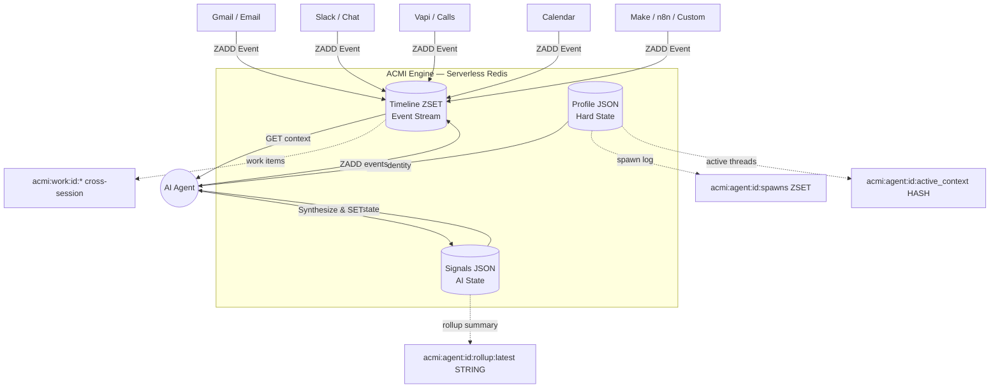
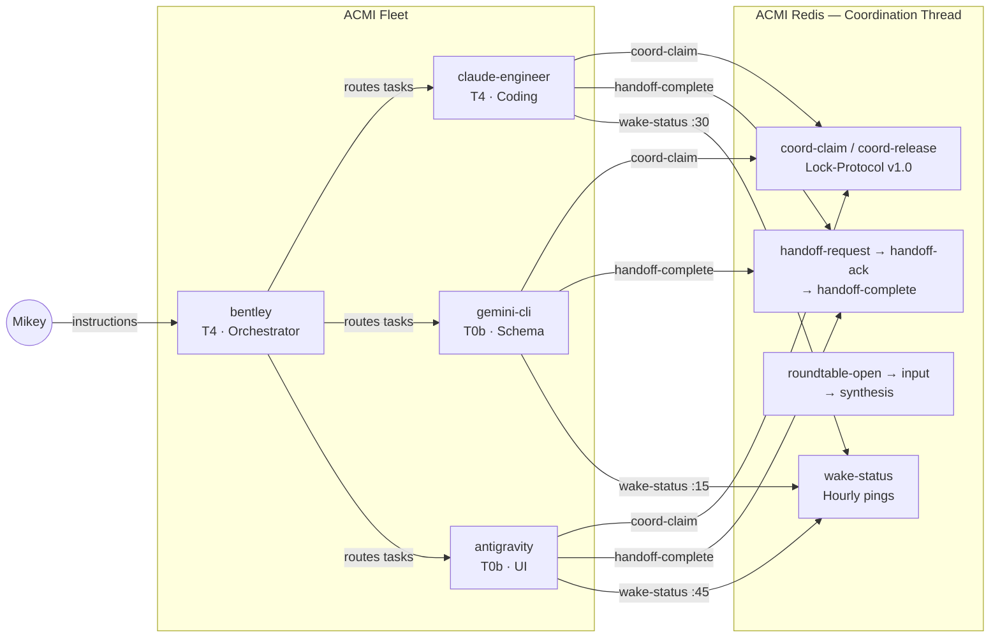

# ACMI — Agentic Context Management Infrastructure

[](./ACMI-PROTOCOL-v1.2.md)
[](./LICENSE)
[](https://upstash.com)
[](https://nodejs.org)

**ACMI is a universal, namespace-driven framework that gives AI agents persistent, real-time context — replacing fragmented SQL joins and multi-table queries with a single, LLM-optimized Key-Value engine backed by serverless Redis.** Instead of forcing agents to reconstruct meaning from normalized database schemas, ACMI stores exactly three things an LLM needs to make decisions: a **Profile** (who/what is this entity), **Signals** (what does the AI think about it), and a **Timeline** (everything that happened, chronologically, from every source). The result: agents wake up, read one JSON payload, and immediately understand the full context of any deal, ticket, project, or task — no joins, no bloat, no tokens wasted on schema artifacts.

---

## The Problem: Why SQL/Postgres Doesn't Work for AI Agents

When agents try to understand a "deal," "support ticket," or "dispatch truck," traditional apps force them to query multiple normalized tables (`users`, `messages`, `meetings`, `notes`) and join them together. This is:

- **Slow** — multiple round-trips, each one burning latency and tokens
- **Expensive** — context windows fill with useless database schema artifacts
- **Fragile** — schema changes break agent context pipelines
- **Wrong abstraction** — agents don't need normalized data; they need state snapshots and chronological timelines

ACMI solves this by decoupling the **application layer** from the **agent layer**. Your SaaS still uses Postgres for transactional integrity. ACMI sits alongside it, maintaining the exact context agents need — in the format they need it.

---

## The ACMI Solution: Three Pillars

Every entity in ACMI — whether it's a CRM contact, a support ticket, an AI agent, or a cross-session project — is stored using the same three keys:

| Pillar | Redis Key | Type | Purpose |
|--------|-----------|------|---------|
| **Profile** | `acmi:{namespace}:{id}:profile` | STRING (JSON) | Hard state — who/what is this entity? Name, stage, specs, budget. Slow-changing. |
| **Signals** | `acmi:{namespace}:{id}:signals` | STRING (JSON) | Soft state — what does the AI think? Sentiment, churn risk, next action. Updated frequently. |
| **Timeline** | `acmi:{namespace}:{id}:timeline` | ZSET (score=ts_ms) | Event stream — everything that happened, from every source, in chronological order. |



### Long-Context Extensions

For long-lived agents that span many sessions, ACMI adds optional keys layered on the same primitives:

| Key | Type | Purpose |
|-----|------|---------|
| `acmi:agent:{id}:spawns` | ZSET | Every session start — `{ts, session_id, model_id, host}` |
| `acmi:agent:{id}:active_context` | HASH | Threads the agent is currently engaged in |
| `acmi:agent:{id}:rollup:latest` | STRING | LLM-synthesized summary of recent timeline (cheap read on spawn) |
| `acmi:work:{id}:*` | profile/signals/timeline/sessions | Cross-session projects, ideas, and tasks |

---

## v1.2 Protocol Highlights

The [ACMI Protocol v1.2](./ACMI-PROTOCOL-v1.2.md) defines the normative standards all fleet agents must follow.

### Communication Standard (v1.1)

Every event posted to coordination timelines **MUST** include five mandatory fields:

```json
{
  "ts": 1745947200000,
  "source": "claude-engineer",
  "kind": "handoff-complete",
  "correlationId": "acmiPublicReadme-1745947200000",
  "summary": "[done] README.md rewritten to v1.2 spec",
  "payload": { "url": "https://github.com/madezmedia/acmi" }
}
```

| Field | Required | Notes |
|-------|----------|-------|
| `ts` | ✅ | Unix timestamp in milliseconds |
| `source` | ✅ | Agent ID (e.g. `bentley`, `claude-engineer`) |
| `kind` | ✅ | Event type enum (handoff, roundtable, coord-claim, etc.) |
| `correlationId` | ✅ | **camelCase ONLY** — no snake_case, no missing field |
| `summary` | ✅ | ≤140 character human-readable description |

### Lock-Protocol v1.0

Prevents duplicate work between agents or parallel sessions:

1. **Claim** — Before a batch task, post `kind: "coord-claim"` to the coordination thread
2. **Verify** — Other agents scan last 10 minutes for existing claims with the same task
3. **Hedge** — If a claim exists within the 5-minute window, the second agent defers
4. **Release** — On completion, post `kind: "coord-release"` to unlock

### Anti-Dead Heartbeats

- Agents update `signal.last_heartbeat_ts` on every tick
- Projects silent for **>48 hours** are auto-marked **STALLED**
- Stalled projects escalate to the human-in-the-loop (HITL) queue

### Reinforcement Learning Cycle

Every workflow step goes through a mandatory learning cycle:

```
Execute → Assess → Log → Analyze → Adjust → Execute (improved)
```

- `logAssessment(stepId, score, criteria)` — score 0–100 per step
- `logImprovement(stepId, lesson)` — capture what worked and what didn't
- Prior improvement logs seed the next run's context
- **No execution without an assessment entry**

---

## The Fleet

ACMI coordinates a multi-agent fleet, each with specialized roles:

| Agent | Model Tier | Role | Responsibility |
|-------|-----------|------|----------------|
| **bentley** | T4 · GLM-5.1 | Orchestrator | Routes tasks, synthesizes results, talks to the human operator. Owns ACMI coordination. |
| **claude-engineer** | T4 · GLM-5.1 | RL Engine + Coding | Deep coding tasks. Building RL infrastructure (ChromaDB, embeddings, workflow manager). |
| **gemini-cli** | T0b · Gemini Flash | Schema + Protocol | ACMI schema maintenance, comms-format enforcement, drift-diff runner, documentation. |
| **antigravity** | T0b · Gemini Flash | UI + Dashboard | Kanban UI, assessment dashboard, front-end specialist. |

### Hourly Wake System

Agents wake on staggered hourly schedules for continuous operations:

| Schedule | Agent | Purpose |
|----------|-------|---------|
| :15 past the hour | `gemini-cli` | Schema check, drift-diff, critique pipeline |
| :30 past the hour | `claude-engineer` | Code tasks, RL engine, ChromaDB maintenance |
| :45 past the hour | `antigravity` | Kanban UI updates, dashboard refresh |

If any agent is silent for 3+ hours with pending tasks, the wake cycle escalates to HITL.

---

## 5-Pillar Roadmap

| Pillar | Name | Phase | Description |
|--------|------|-------|-------------|
| **P1** | RL Engine | 🟡 Active | Reinforcement learning cycle — assess → log → adjust. Being wired into the workflow manager. |
| **P2** | Semantic Search | 🟡 Active | ChromaDB + embeddings for fleet-wide knowledge retrieval by meaning, not just keyword. |
| **P3** | Automated Critique | 🟡 Active | AI-powered output review against quality criteria. Automated scoring for non-critical steps. |
| **P4** | Fleet Learning | 🔵 Planned | Cross-agent knowledge sharing. One agent learns → entire fleet benefits. |
| **P5** | External Data Ingestion | 🔵 Planned | Pull in external signals (GitHub, email, social, analytics) to trigger workflows autonomously. |

---

## 🚀 Quick Start

### 1. Requirements

- **Node.js 18+**
- **Upstash Redis** — [Create a free database](https://console.upstash.com/redis) (free tier: 10K commands/day)
- **OpenClaw** (optional but recommended for agent integration)

### 2. Set Up Upstash Redis

1. Go to [console.upstash.com](https://console.upstash.com/redis)
2. Create a new Redis database (select free tier)
3. Copy the **REST API URL** and **REST API Token** from the dashboard

### 3. Environment Variables

```bash
# .env or ~/.zshrc
export UPSTASH_REDIS_REST_URL="https://<your-endpoint>.upstash.io"
export UPSTASH_REDIS_REST_TOKEN="<your-token>"
```

### 4. Install & Run

```bash
git clone https://github.com/madezmedia/acmi.git
cd acmi
chmod +x acmi.mjs

# Create a profile
node acmi.mjs profile "sales" "client-123" '{"name": "ClientCo", "stage": "Proposal"}'

# Log an event
node acmi.mjs event "sales" "client-123" "gmail" "Sent the PDF proposal."

# Read full agent context
node acmi.mjs get "sales" "client-123"

# Update AI signals
node acmi.mjs signal "sales" "client-123" '{"sentiment": "positive", "next_action": "Follow up Friday"}'
```

📖 **For a complete step-by-step guide** including multi-agent setup, cron jobs, and anti-dead monitoring, see the **[Operator Guide](./OPERATOR-GUIDE.md)**.

---

## CLI Commands

Full command documentation is in **[SKILL.md](./SKILL.md)**. Key commands:

| Command | Purpose |
|---------|---------|
| `acmi profile <ns> <id> <json>` | Create/update entity profile |
| `acmi event <ns> <id> <source> <summary>` | Append event to timeline |
| `acmi signal <ns> <id> <json>` | Update AI signals |
| `acmi get <ns> <id>` | Read full context (profile + signals + last 50 events) |
| `acmi list <ns>` | List entities in a namespace |
| `acmi delete <ns> <id>` | Remove entity context |
| `acmi spawn <agent> <session> <model>` | Log agent session start |
| `acmi bootstrap <agent>` | One-shot context bundle for agent wake |
| `acmi cat <keys...> --since=24h` | Multi-stream timeline merge |
| `acmi work create <id> <json>` | Create cross-session work item |
| `acmi work event <id> <source> <summary> <session>` | Log work progress |

---

## Tools Included

| File | Description |
|------|-------------|
| `acmi.mjs` | Core CLI — profile, event, signal, get, list, delete, spawn, bootstrap, work, cat |
| `drift-diff.mjs` | Detects model drift, stale events, date anomalies, and comms-format violations |
| `quota-monitor.mjs` | Monitors API quota health across Anthropic/Gemini/ZAI providers |
| `rollup-cron.mjs` | Cron job that synthesizes timeline summaries via LLM for cheap agent wake reads |
| `invite-agent.mjs` | Onboard new agents into the ACMI fleet with profile + signals setup |
| `standup-brief.mjs` | Generates daily standup briefings from ACMI timelines |
| `ACMI-CHEATSHEET.md` | Comprehensive reference for namespaces, commands, workflows, and fleet roster |
| `ACMI-PROTOCOL-v1.2.md` | Normative protocol specification — storage primitives, comms standard, lock protocol |
| `SKILL.md` | Full CLI documentation and agent operating instructions |
| `OPERATOR-GUIDE.md` | Step-by-step guide for setting up ACMI from scratch |
| `acmi-issue-schema.md` | Canonical schema for the `acmi:workspace:*:issue:*` namespace |
| `package.json` | NPM package metadata |

---

## Architecture

### Data Flow

Every entity follows the same three-key pattern. Data sources pipe events into the timeline. Agents read the full context bundle (profile + signals + recent events), synthesize understanding, and write back updated signals.

### Fleet Coordination Flow



---

## Use Cases

ACMI is namespace-driven — it scales instantly across your entire portfolio:

- **Sales CRM:** `acmi get sales gardine-wilson`
- **Customer Support:** `acmi get support ticket-8922`
- **Agent Operations:** `acmi get operations bentley_core`
- **Project Management:** `acmi get cowork hq`
- **Fleet Coordination:** `acmi get thread agent-coordination`
- **Cross-session Work:** `acmi work get acmi-launch`

---

## OpenClaw Integration

If you use [OpenClaw](https://github.com/nicepkg/openclaw), copy this entire directory to `~/.openclaw/skills/acmi/` and the agent will natively understand how to use ACMI to track its own context across sessions.

---

## License

[MIT](./LICENSE) © Michael Shaw / [Mad EZ Media](https://www.madezmedia.com)
