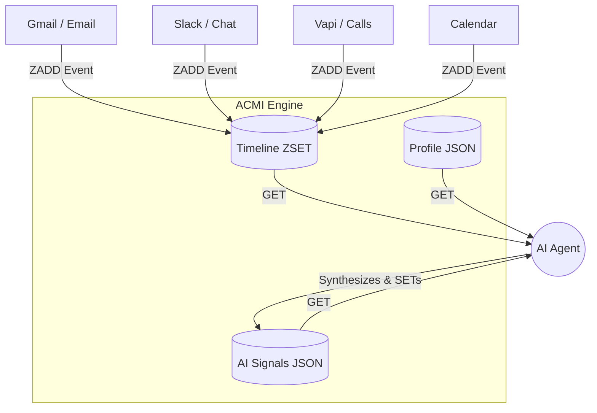

# Agentic Context Management Infrastructure (ACMI)


ACMI is a universal, namespace-driven framework for giving AI agents persistent, real-time context without the bloat of relational databases.

## The Problem with Postgres/SQL for Agents
When agents try to understand a "deal", "support ticket", or "dispatch truck", traditional apps force them to query multiple normalized tables (`users`, `messages`, `meetings`, `notes`) and join them. This is slow, expensive, and results in context windows filled with useless database schema artifacts.

## The ACMI Solution
Agents don't need SQL joins. They need **state snapshots** and **chronological timelines**.

ACMI uses a lightning-fast Key-Value store (Upstash Redis) to maintain the exact three things an LLM needs to make decisions:
1. **Profile (Hard State):** Who/what is this entity? (Also used to store dynamic Agent operating rules/personas).
2. **Signals (Soft State):** What does the AI think about this entity? (Sentiment, Risk, Next Actions)
3. **Timeline (Event Stream):** What exactly has happened to this entity, in chronological order, across every platform?

---

## 🏗 Architecture



### The Three Keys
For any given entity, ACMI maintains:
* `acmi:{namespace}:{id}:profile`
* `acmi:{namespace}:{id}:signals`
* `acmi:{namespace}:{id}:timeline` (Redis Sorted Set, scored by Unix timestamp)

---

## 🚀 Quick Start

### 1. Requirements
* Node.js
* A free serverless Redis database from [Upstash](https://console.upstash.com/redis).

### 2. Environment Variables
Add these to your environment (e.g., `.env` or `~/.zshrc`):
```bash
export UPSTASH_REDIS_REST_URL="https://<your-endpoint>.upstash.io"
export UPSTASH_REDIS_REST_TOKEN="<your-token>"
```

### 3. Basic Usage (CLI)

#### Create a Profile (CRM Data or Agent Personas)
```bash
# Setting up a CRM entity
node acmi.mjs profile "sales" "client-123" '{"name": "ClientCo", "stage": "Proposal"}'

# Setting up dynamic rules for a subordinate Agent (e.g., Claude Code)
node acmi.mjs profile "operations" "claude_core" '{"role": "engineer", "delegation_rules": "No business logic."}'
```

#### Log Events (Pipe webhooks directly here)
```bash
node acmi.mjs event "sales" "client-123" "gmail" "Sent the PDF proposal."
node acmi.mjs event "cowork" "hq" "openclaw" "Agent session started."
```

#### Read the Full Agent Context
```bash
# Returns a clean JSON object containing the profile, signals, and last 50 events chronologically.
node acmi.mjs get "sales" "client-123"
```

#### Update AI Signals (Agent loops back)
```bash
node acmi.mjs signal "sales" "client-123" '{"sentiment": "positive", "next_action": "Follow up Friday"}'
```

---

## 💡 Use Cases

Because ACMI is **namespace-driven**, it scales instantly across your entire SaaS portfolio and internal orchestration.

*   **Sales CRM:** `acmi get sales gardine-wilson`
*   **Customer Support:** `acmi get support ticket-8922`
*   **Agent Operations (Dynamic Personas):** `acmi get operations bentley_core`
*   **Project Management / Cowork HQ:** `acmi get cowork hq`

---

## 🤖 OpenClaw / Agent Integration

If you use OpenClaw, copy this entire directory to `~/.openclaw/skills/acmi/` and the agent will natively understand how to use `acmi.mjs` to track its own context across sessions.
