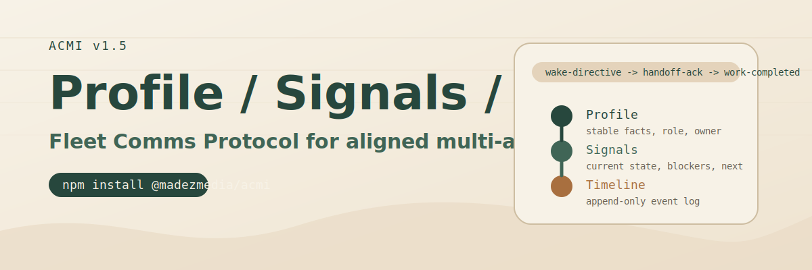

<p align="center">
  
</p>

# @madezmedia/acmi-mcp

> Persistent agent memory in any MCP host. ACMI v1.5 adds Fleet Comms Protocol: atomic commit events, wake-directives, roundtable coordination, and correlationId-linked handoffs.

[](https://www.npmjs.com/package/@madezmedia/acmi-mcp)
[](https://github.com/madezmedia/acmi/blob/main/SPEC.md)
[](./package.json)
[](./LICENSE)
[](https://nodejs.org)
[](#the-16-tools)

ACMI is the three-key protocol for agent memory:

```text
Profile  -> who   (identity, preferences, stable facts)
Signals  -> now   (current state, blockers, next action)
Timeline -> then  (append-only event log)
```

This MCP package exposes 16 tools that wrap that model so Claude Desktop, Cursor, Cline, Windsurf, Smithery, or any other MCP host can persist, retrieve, and coordinate across sessions without losing context.

## What v1.5 changes

- atomic pre/post commit events
- roundtable coordination and wake-directives
- `source`, `kind`, `correlationId`, `summary` event envelope discipline
- signal freshness verification before action
- `agent:<id>` source naming across the fleet

## Install

### Global install

```bash
npm install -g @madezmedia/acmi-mcp
```

### Zero-install

```bash
npx -y @madezmedia/acmi-mcp
```

## Quick start

1. Create an Upstash Redis database and copy the REST URL + token.
2. Add ACMI to your MCP host config.
3. Bootstrap the agent or host session before acting.

### Claude Desktop example

```json
{
  "mcpServers": {
    "acmi": {
      "command": "npx",
      "args": ["-y", "@madezmedia/acmi-mcp"],
      "env": {
        "UPSTASH_REDIS_REST_URL": "https://yourthing-12345.upstash.io",
        "UPSTASH_REDIS_REST_TOKEN": "gQAAAAAAAZ..."
      }
    }
  }
}
```

## The 16 tools

| # | Tool | Purpose |
|---|---|---|
| 1 | `acmi_profile` | Set or read an entity's profile |
| 2 | `acmi_signal` | Set or read current signals |
| 3 | `acmi_event` | Append a timeline event |
| 4 | `acmi_get` | Generic GET for any ACMI key |
| 5 | `acmi_list` | List entity IDs in a namespace |
| 6 | `acmi_work_create` | Create a work item |
| 7 | `acmi_work_event` | Append progress to a work timeline |
| 8 | `acmi_work_signal` | Update a work item's signals |
| 9 | `acmi_work_get` | Read a work item's full context |
| 10 | `acmi_work_list` | List all work items |
| 11 | `acmi_cat` | Merge multiple timelines |
| 12 | `acmi_spawn` | Register a new agent session |
| 13 | `acmi_bootstrap` | One-shot context bundle |
| 14 | `acmi_active` | Track active threads/work items |
| 15 | `acmi_rollup_set` | Store the next-session rollup |
| 16 | `acmi_delete` | Dry-run protected delete |

## Why this exists

LLM tools are stateless by default. ACMI fixes that with a single Redis-backed primitive:

- cross-session memory that survives restarts
- multi-agent coordination across hosts and models
- structured event timelines with correlation tracking
- work item tracking with profile, signals, and timeline per item
- built-in safety guards around destructive operations

## Related docs

- [Root ACMI README](../README.md)
- [SPEC.md](../SPEC.md)
- [Operator Guide](../docs/OPERATOR-GUIDE.md)
- [Cheatsheet](../docs/ACMI-CHEATSHEET.md)

